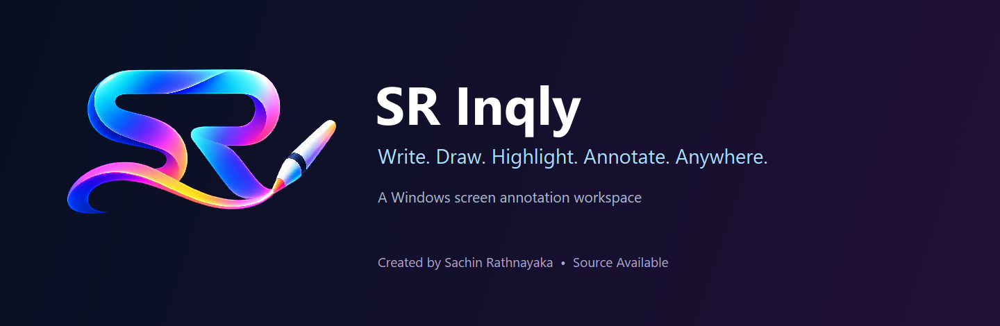
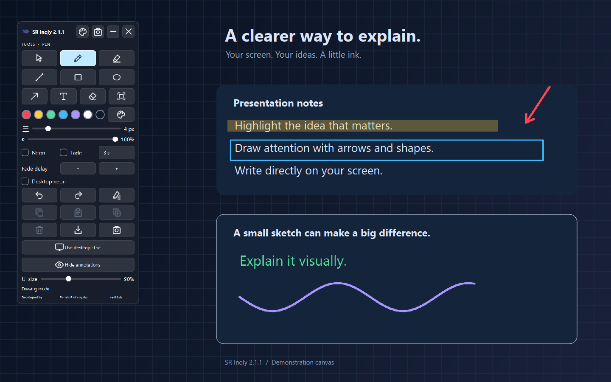
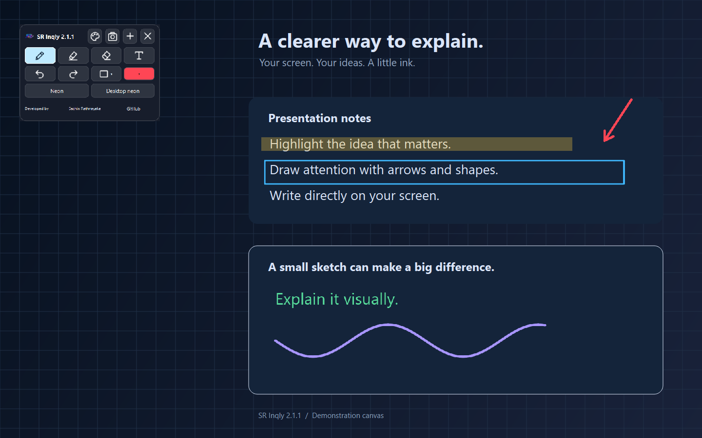
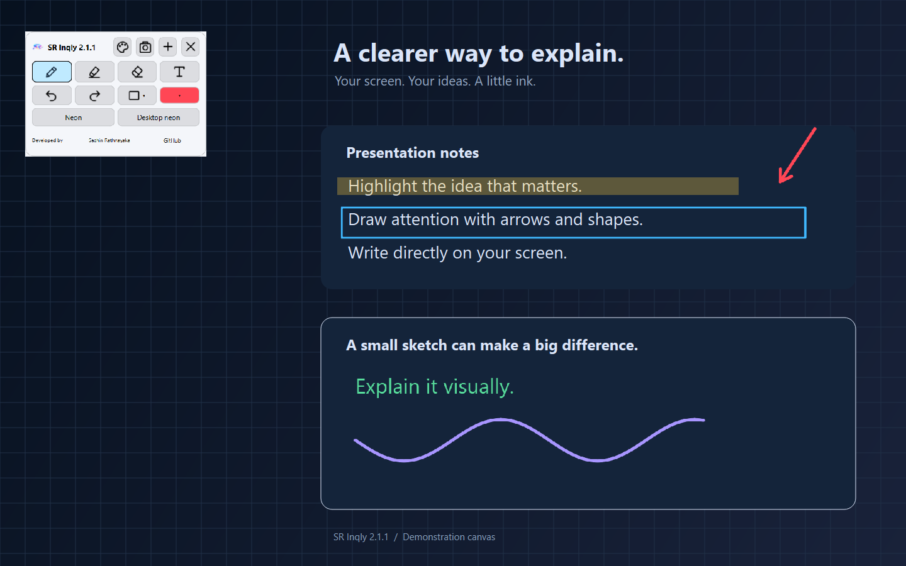
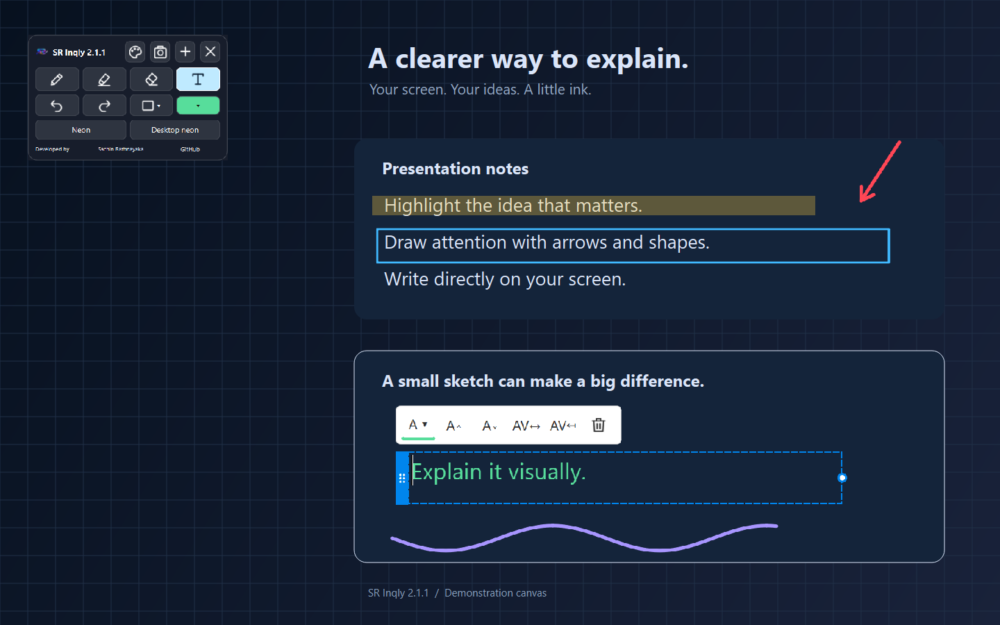
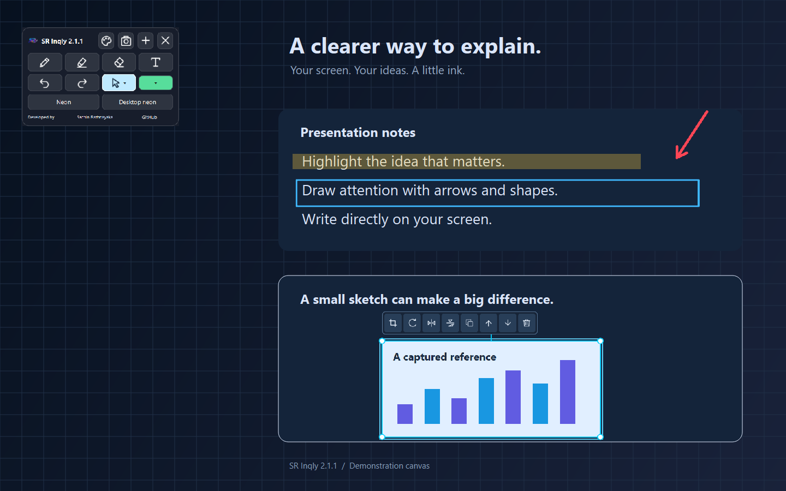
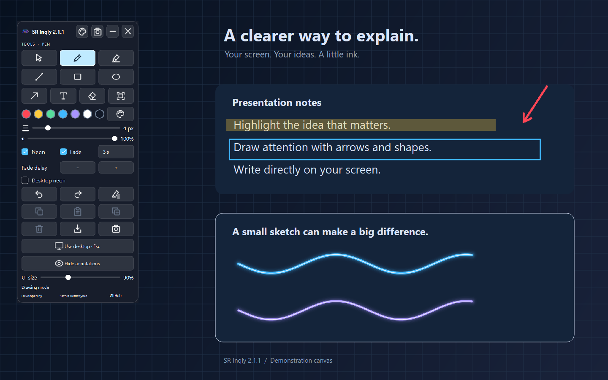

<div align="center">



**A compact Windows workspace for drawing, highlighting and explaining anything on your screen.**


[Explore the interface](#the-interface) · [Get started](#get-started) · [Tools & shortcuts](#tools-and-shortcuts) · [Build from source](#development) · [License](#license)

Created by **[Sachin Rathnayaka](https://github.com/SachinRathnayaka)**

</div>

---

SR Inqly places a transparent annotation layer over your Windows desktop. Use it to explain a slide, highlight a document, sketch an idea or capture a screen region and work with it as an image. Its floating toolbar keeps drawing tools close, while desktop mode lets you return to your applications immediately.

## The interface



*Actual SR Inqly 2.1.1 controls and annotations over a generated demonstration canvas. Screenshots contain no personal desktop files.*

| Compact workspace | Light theme |
| --- | --- |
|  |  |

| Inline text editing | Fetcher image editing |
| --- | --- |
|  |  |

## What you can do

| Feature | How it helps |
| --- | --- |
| **Draw over Windows apps** | Pen, line, arrow, rectangle and ellipse tools for explanations and quick sketches. |
| **Neon pen** | A glow in your selected ink color, with permanent or temporary strokes. |
| **Temporary pen trails** | Hold each part for 1–15 seconds, then smoothly fade from the start of the drawn path. |
| **Desktop neon** | Optional click-through mouse trails while ordinary desktop clicks and drags continue. |
| **Highlight with separate settings** | The marker keeps its own color, width and opacity, independent of the pen and other tools. |
| **Edit text in place** | Type directly into a movable text box with a blinking caret; adjust color, size, spacing, font, alignment and background. |
| **Select and move annotations** | Smart selection and group movement, with additional rectangle, lasso and polygon selection options. |
| **Capture with Fetcher** | Turn a screen region into an image object; move, resize, rotate, flip, duplicate and re-crop it. |
| **Take a quick screenshot** | One click saves a unique PNG in **Pictures / SR Inqly Screenshots**. The same folder is reused. |
| **Use a smaller toolbar** | Compact mode keeps everyday tools within reach; expand for more controls and UI scaling. |
| **Make the UI your own** | Light, dark and custom-color themes; a separate dialog for crosshair color, thickness and size. |
| **Undo your edits** | Undo/redo supports drawing, text, image transformations, deletion and layer changes. |
| **Keep your preferences** | Tool settings, theme, cursor settings, UI scale and toolbar position persist between sessions. |

## Get started

Download **SR Inqly 2.1.1** from the [official release](https://github.com/SachinRathnayaka/SR-Inqly/releases/tag/v2.1.1). Choose the Windows installer or portable ZIP below.

### Windows installer

1. Download [`SR.Inqly.Setup.2.1.1.exe`](https://github.com/SachinRathnayaka/SR-Inqly/releases/download/v2.1.1/SR.Inqly.Setup.2.1.1.exe).
2. Run the installer and follow the setup wizard.
3. Open **SR Inqly** from the Start menu. A desktop shortcut is optional during installation.

The installer uses a per-user location under `%LOCALAPPDATA%\Programs\SR Inqly`. Uninstall through **Windows Settings → Apps**. Saved screenshots and preferences are retained.

### Portable version

1. Download [`SR-Inqly-2.1.1-Windows-Portable.zip`](https://github.com/SachinRathnayaka/SR-Inqly/releases/download/v2.1.1/SR-Inqly-2.1.1-Windows-Portable.zip).
2. Use **Extract All** to extract the complete archive.
3. Open `SR Inqly.exe` and keep its `_internal` folder beside it.

Python is included in packaged builds; end users do not need to install it. Current binaries are **unsigned**, so Windows may display a publisher or SmartScreen notice. Compare your downloaded file's SHA-256 with the release checksum file.

### Your first annotation

The app starts in desktop mode. Click a tool to begin drawing. Click the active tool again—or press **Esc**—to return to desktop mode. Tool highlights clear when drawing is inactive. Click a tool to resume.

Use **Theme** for appearance, cursor settings and About. The developer name shows information on hover; the separate **GitHub** button opens the official profile after releasing desktop input.

### Neon and fading pen

Choose **Pen**, then tick **Neon** for a glow or **Fade** for temporary strokes. The delay selector controls how long each part remains visible before fading. Compact mode exposes these options inside the color dropdown.

**Desktop neon · mouse stays usable** is a separate opt-in mode. Left-button drags draw fading trails while the underlying app still receives those clicks and drags. It is off after each restart. Temporary trails are not selectable and cannot be restored with Redo. [Behavior and limits](docs/pen-effects.md).



## Tools and shortcuts

| Action | Shortcut or control |
| --- | --- |
| Return to desktop mode / cancel current operation | **Esc** |
| Toggle desktop and drawing modes | **Ctrl + Alt + D** |
| Emergency exit | **Ctrl + Alt + Q** |
| Undo / redo | **Ctrl + Z** / **Ctrl + Y** |
| Copy selected object or image | **Ctrl + C** |
| Duplicate selection | **Ctrl + D** |
| Delete selection | **Delete** |
| Commit inline text | **Ctrl + Enter** |
| Resize a Fetcher image freely | Hold **Shift** while dragging a corner |

Global shortcuts can be affected by conflicts with other Windows applications. Keep Esc and the toolbar's desktop control available while working.

### Inline text

Choose **Text**, then click to create a text box. Click existing text to edit it. Use the side grip to move the box and its width handle to resize it. The floating bar gives quick access to color, font size, letter spacing and delete; expand the main toolbar for more formatting controls.

The stale-text fix introduced in 2.0.4 remains included: editing or moving a text box clears the old rendered characters.

### Fetcher

Choose **Fetcher**, drag a rectangle and release. SR Inqly hides its controls before capturing, then selects the resulting image. The original pixels are preserved through crop and transformation edits.

| Direct control | Click | Modifier |
| --- | --- | --- |
| Crop | Open re-crop editor | Restore the full image inside the editor |
| Rotate | Rotate clockwise 90° | **Shift:** counterclockwise · **Ctrl:** reset orientation |
| Flip horizontal / vertical | Toggle the corresponding flip | Click again to restore |
| Copy | Copy the transformed image | **Shift:** duplicate |
| Forward | Move one layer forward | **Shift:** bring to front |
| Backward | Move one layer backward | **Shift:** send to back |
| Delete | Remove the selected image | Undo remains available |

Drag the image to move it, a corner to resize it, or the handle above it to rotate freely. Corner resizing preserves aspect ratio by default. Re-crop works from the original image, so previously cropped content can be restored.

## Development

The source layout is organized for a normal GitHub checkout. Recommended development environment: **Windows 10/11, Python 3.13**, with the tested dependencies pinned in the requirements files.

```powershell
git clone https://github.com/SachinRathnayaka/SR-Inqly.git
cd SR-Inqly
py -3.13 -m venv .venv
.\.venv\Scripts\python.exe -m pip install -r requirements-dev.txt
.\.venv\Scripts\python.exe run.py
```

### Check the source

```powershell
# Document and renderer regressions, without a visible desktop
.\.venv\Scripts\python.exe scripts/run_checks.py --headless

# Native Windows UI checks: use desktop focus and clipboard
.\.venv\Scripts\python.exe scripts/run_checks.py --all

# A specific regression
.\.venv\Scripts\python.exe scripts/run_checks.py text_cache_move
```

GitHub Actions runs the renderer checks on Windows. Native desktop checks remain a local verification step.

### Build installer and portable archives

Install **Inno Setup 6**, then run:

```powershell
powershell -ExecutionPolicy Bypass -File scripts/build_release.ps1 `
  -Python ".\.venv\Scripts\python.exe"
```

If the compiler is in a custom location, pass `-CompilerPath "C:\path\to\ISCC.exe"`.

The build checks the renderer, creates a windowed PyInstaller executable, smoke-tests the EXE, creates the installer, then generates verified portable/source ZIPs and SHA-256 checksums under `dist/`. See [the build guide](docs/building.md) and [publishing checklist](docs/publishing.md).

### Repository layout

```text
sr-inqly/
├── run.py                  # Source launcher
├── src/                    # Application, document, text, rendering and capture
├── assets/                 # Product logo and multi-resolution icons
├── tests/                  # Standalone functional and native regressions
├── scripts/                # Test runner, screenshots and release packaging
├── packaging/              # PyInstaller spec, installer and Windows metadata
├── docs/
│   ├── images/             # README screenshots and banner
│   ├── reports/            # Implementation and optimization evidence
│   └── benchmarks/         # Historical diagnostic measurements
├── licenses/               # Third-party license texts
└── .github/                # Renderer CI and issue templates
```

## Performance and current limits

SR Inqly uses incremental freehand paths, dirty redraw regions and a reusable raster scene layer. Command caching has an accounted **16 MiB** limit, the scene layer **64 MiB**, document history **32 MiB / up to 100 states**, and original Fetcher images **128 MiB**. These limits are separate and do not cap total process memory. A capture or clipboard image is limited to **32 million pixels**; old history may be discarded under memory pressure.

[Performance review](docs/reports/performance-review.md) · [Optimization audit](docs/reports/optimization-audit.md) · [Measurement files](docs/benchmarks)

Measurements are offscreen rendering diagnostics, not a guarantee of end-to-end FPS. Physical mixed-DPI multi-monitor hotplug, dual 4K displays, 120/144 Hz, sleep/wake and exclusive fullscreen applications still need hardware testing. Pressure-aware stylus rendering is not implemented. Quick PNG encoding is synchronous. A 30–60 minute soak is still outstanding.

Historical reports refer to earlier builds and their original filenames; [the current build guide](docs/building.md) describes this repository's layout.

## Feedback

Have a reproducible problem or a useful workflow idea? Use the repository's [Issues](https://github.com/SachinRathnayaka/SR-Inqly/issues) tab and the supplied templates. See [CONTRIBUTING.md](CONTRIBUTING.md) for feedback and development guidance, and [SECURITY.md](SECURITY.md) for sensitive reports.

## License

**Source Available — Copyright © 2026 Sachin Rathnayaka. All Rights Reserved.**

Source viewing, learning, personal study and personal evaluation are permitted under [LICENSE](LICENSE). Commercial exploitation, unauthorized redistribution, rebranding and publishing modified versions require prior written permission. A public GitHub repository does not change these terms.

Qt/PySide6, Python, PyInstaller, Inno Setup and other bundled components retain their own licenses and rights. Read [THIRD_PARTY_NOTICES.md](THIRD_PARTY_NOTICES.md) and [licenses/](licenses/) before distributing builds. This project is not represented as an unrestricted open-source release.

---

<div align="center">

**SR Inqly** · Write • Draw • Highlight • Annotate • Anywhere<br>
Designed and developed by [Sachin Rathnayaka](https://github.com/SachinRathnayaka)

</div>
